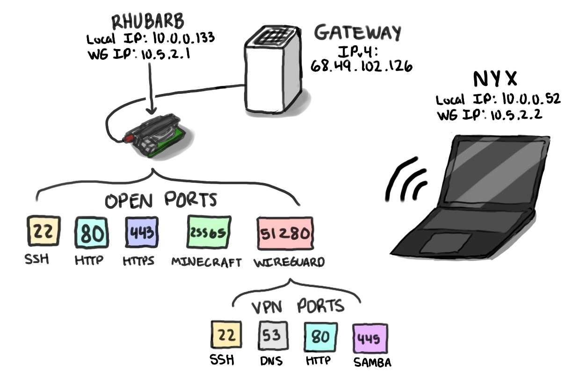

# Home Lab and Infrastructure Documentation

**Hi there!** For a while now, I've been slowly adding to a home server project as a way to familiarize myself with linux, take greater ownership and resposibility for my data, and also, I just think it's really cool.

My server's name is Rhubarb, a play-on-words that refers to the Raspberry Pi it's hosted on (rhubarb pie is also delicious), but also a bit a nod to the concept of "rhubarb forcing", a method of growing rhubarb where it's grown in a hot, dark environment that leads it to grow much faster than normal, and creates sweeter, more tender stalks. With Rhubarb (the server), I'm employing chaos engineering to acheive a similar goal: when put under high loads (stress testing), the system must lern (via automation) how to survive (stay up) and grow, leading to a much more resilient and desirable outcome (a server with built-in, automated failsafes).

### About This Repo

Here, I've done my best to document not only the setup and configuration of my server, but also the things I've learned along the way (in changelog.txt), and reasoning for the design decisions I've made. I want anyone who is vaguely interested in self-hosting to be able to look at this guide, see the cool things that self-hosting can enable, and have a good starting point for making their own thing. For me, it's also very helpful for keeping things intentional and organized, as I won't add a feature that isn't documented and justified.

There are four main components to this repo:
1. The README (this part!), describing a high-level overview of the project
2. The Change Log (ChangeLog.md), describing discrete chunks of progress I've made on the server, my biggest challenges, what I learned, and what I plan to do next.
3. The Runbook (Runbook.md), describing how to perform the initial server setup, as well as how to perform routine maintenance tasks (configuring nginx files, docker images, etc.)
4. Scripts and configs. These are copies of crucial files from the server with sensetive information redacted.

