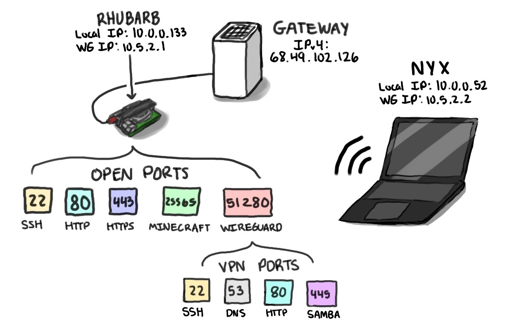

# Home Lab (Rhubarb)

For a while now, I've been slowly adding to a home server project as a way to familiarize myself with Linux, take greater ownership and resposibility for my data, and also, I just think it's really cool.

My server's name is Rhubarb, a play on words that refers to the Raspberry Pi it's hosted on (rhubarb pie is also delicious), but also a bit a nod to the concept of "rhubarb forcing", a method of growing rhubarb where it's grown in a hot, dark environment that leads it to grow much faster than normal, and creates sweeter, more tender stalks.

### Chaos Agent (Herbicide)

With Rhubarb (the server), I'm employing chaos engineering to acheive a similar goal: when put under high loads (stress testing), the system must learn (via automation) how to survive (stay up) and grow, leading to a much more resilient and desirable outcome (a server with built-in, automated failsafes).

<figure>
	
	<figcaption> Rhubarb network infrastructure diagram </figcaption>
</figure>

### About This Repo

This repo has three main parts:

#### `/rhubarb`
- Configuration files that are crucial for the operation of the server (Docker, WireGuard, CoreDNS, Samba, Nginx)
- Automation scripts that are responsible for detecting and recovering from fail states

#### `/herbicide`
- Files for Terraform and Ansible configuration
- Chaos testing scripts that are run from Ansible
- Configuration files for Grafana diagnostic dashboards

#### `/diagrams`
- Drawings of various aspects of the server with accompanying descriptions
- Includes diagrams for architecture overview (displayed above), Herbicide command flow, WireGuard protocol overview, and how logs/metrics are collected and displayed with Alloy, Loki, Prometheus, and Grafana.
